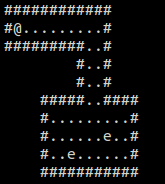

Creating Custom Maps
====================

Welcome to the tutorial for creating custom maps
for CotB!

How Loading Maps Works
----------------------

All CotB maps are stored as raw text files. CotB reads
each character of the map file and loads tile data.
Loaded tiles are based on the characters in the map file.

The following map characters are supported:

.. _tile table:

+----+------------------+
+Char+ Tile             +
+====+==================+
+ #  + Wall tile        +
+----+------------------+
+ .  + Floor tile       +
+----+------------------+
+ \- + Empty Space tile +
+----+------------------+
+ \+ + Door tile        +
+----+------------------+
+ e  + Enemy tile       +
+----+------------------+

.. note::

	The floor tile character is only by convention. CotB
	recognizes any character not already taken as
	walkable floor tiles.

.. warning::

	The player, represented by a '@' character, is
	**always** placed in the top left corner of the map.
	Do not put a '@' character in any map files.
	Do not fill the top left corner with Empty Space tiles.

Creating a Simple Map
---------------------

The following instructions will create a simple map file
containing one room with some enemies:

1) Navigate to the /map directory in the project files (see
   :ref:`downloads <dl>`)
2) Create a raw text file, for example ``custom_map.txt``
3) Paint a simple room with the characters listed above
   (see :ref:`tile table <tile table>`). Example:

   .. image:: ./res/simple_map.png

4) Add enemies to the map. Example:

   .. image:: ./res/simple_map_enemies.png

5) Execute the run script in the /src directory passing
   the name of your map from step 2.

   ``./run custom_map.txt``

   Result:

   .. image:: ./res/simple_map_result.png

Creating a Complex Map
----------------------

.. todo::
	
	Add more robust step by step guide to creating a complex map.

Creating more complex maps is also possible with the use
of the Empty Space tiles (see :ref:`tile table <tile table>`).

Example: The following map file

.. image:: ./res/complex_map.png

will be drawn to the screen as

